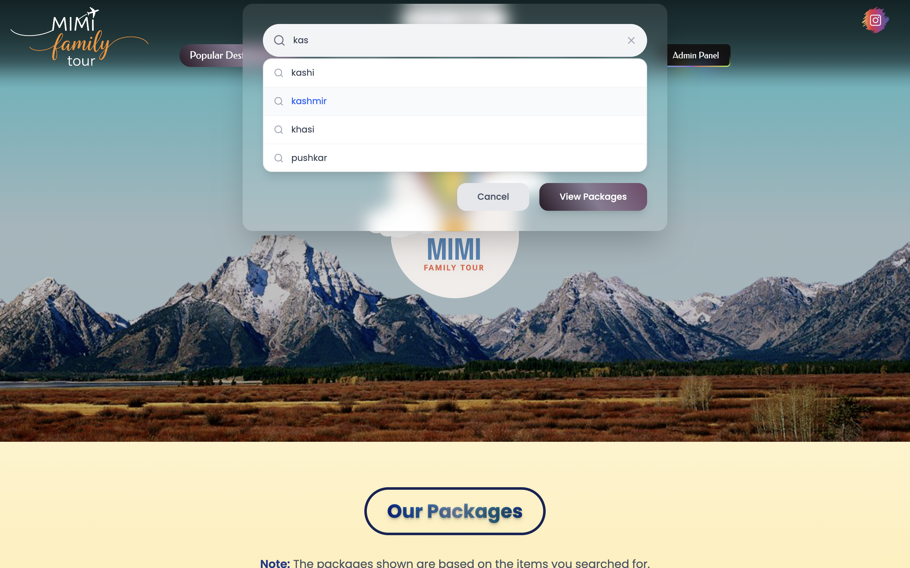
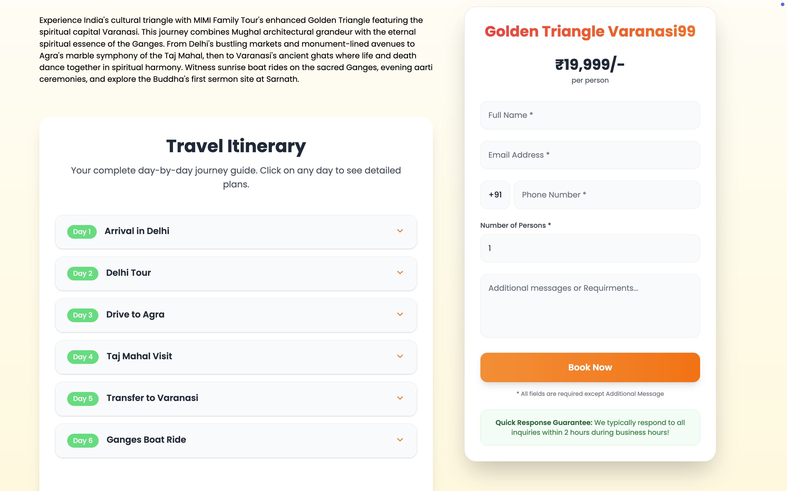
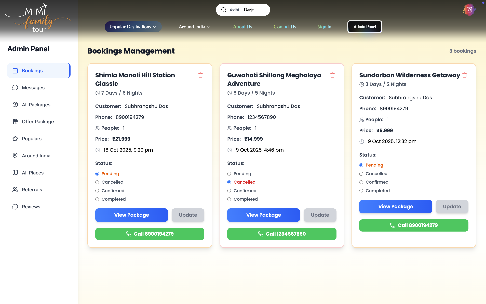
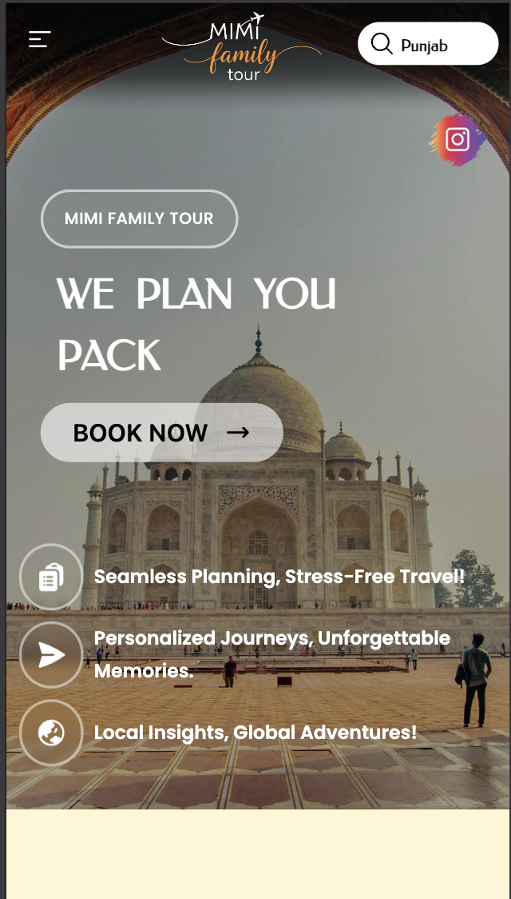
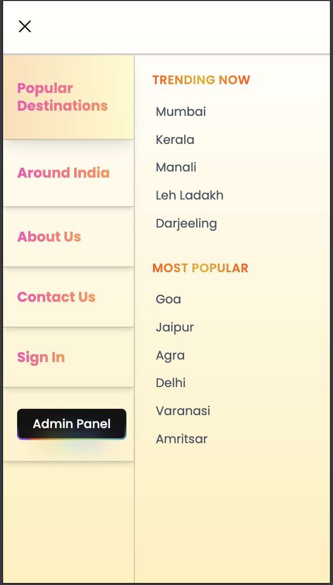

# 🌍 MMI-FAMILY-TOUR: Professional Travel Booking Platform

This repository contains the source code for a modern, **full-stack travel agency website**, developed as a freelance project for **Mimi Family Tour**.  
Built with **Next.js**, it offers a professional, responsive user experience for booking tours and a secure, comprehensive **Admin Dashboard** for managing operations.

---

## ✨ Key Features

This application is engineered for **performance**, **scalability**, and a **beautiful user experience**.

---

### 🌐 Frontend & UI

- **Modern & Responsive UI:**  
  A clean, aesthetically pleasing design built with **Tailwind CSS**, ensuring seamless responsiveness across all devices (mobile, tablet, desktop).

- **Sleek Animations:**  
  Utilizes **Framer Motion** for smooth UI transitions, hover effects, and page routing animations — creating a modern, premium feel.

- **Dynamic Visuals:**  
  Features engaging **Parallax Scrolling Effects** that add depth and visual appeal to key sections of the landing page.

- **Gallery Integration:**  
  Uses **Swiper.js** for touch-friendly, high-performance image carousels across package details and galleries.

- **Iconography:**  
  Leverages **Lucide React** for a clean, consistent, and modern set of icons.

- **Comprehensive Package Listings:**  
  Features **40+ meticulously curated travel packages**, each with multiple high-quality, handpicked images.

---

### ⚙️ Backend & Data

- **Full-Stack Architecture:**  
  Built on the **Next.js** framework, leveraging server-side code and API endpoints.

- **Integrated API:**  
  All API routes are managed internally within the Next.js project, ensuring a fast, cohesive full-stack environment.

- **Authentication:**  
  Secure user and admin sign-in handled via **NextAuth**.

- **Database Management:**  
  Data persistence handled by **MongoDB**, connected via **Mongoose**, for reliable storage of all user and application data.

---

### 🔒 Administrative & Management Features

The **private Admin Dashboard** provides the client with full control over the platform's data and operations:

| Feature | Description |
|----------|-------------|
| **Booking Management** | Review, track, and manage all incoming package bookings from users. |
| **Package Control** | Add, edit, or delete existing travel packages, including day-by-day itineraries, prices, and images. |
| **User Messaging** | View and respond to user messages, inquiries, and contact requests. |
| **Referrals & Offers** | Manage special offers, discounts, and referral codes for promotions. |

---

### ✈️ User Functionality

The front-facing application provides a smooth, end-to-end booking experience:

- **Detailed Packages:**  
  Each package includes a day-by-day itinerary, pricing, and key highlights.

- **Seamless Booking:**  
  Users can easily select and book any travel package directly through the site.

- **Contact & Inquiry:**  
  Users can send messages or inquiries directly to the travel agency — all logged in the database and viewable in the Admin Panel.

---

## 🛠️ Tech Stack & Dependencies

| Category | Technology |
|-----------|-------------|
| **Framework** | Next.js (React) |
| **Styling** | Tailwind CSS |
| **Database** | MongoDB |
| **ORM** | Mongoose |
| **Authentication** | NextAuth.js |
| **Animation** | Framer Motion |
| **Visuals** | Swiper.js, Lucide React |
| **Utilities** | clsx, tailwind-css |

---

## 🖼️ Project Screenshots

Here’s a visual walkthrough of the **Mimi Family Tour** platform — from the landing page to the admin panel.

---

### 🏖️ Hero Section

> Clean, welcoming hero banner introducing the brand with a call to action.

---

### 🔍 Search Functionality

> Users can explore destinations by name, region, or category — smooth and responsive.

---

### 🧳 Search Results – Travel Packages

> Displays curated packages dynamically with images, pricing, and quick view details.

---

### 🏝️ Package Details Page

> Each package includes a detailed day-by-day itinerary, pricing breakdown, and image gallery.

---

### 🧾 Booking Form & Itinerary Plans

> Users can seamlessly book tours and view personalized travel plans in one place.

---

### 🛡️ Admin Dashboard

> The admin panel offers complete control over bookings, packages, and messages.

---

### 📱 Mobile Hero Section

> Optimized for mobile with a responsive, clean hero layout.

---

### 🍔 Mobile Menu (Hamburger)

> Compact and smooth mobile menu with easy navigation across sections.

---

## 🤝 Freelance Contact

This project was developed by **Subhrangshu Das** for **Mimi Family Tour**.  
📦 **GitHub:** [@subhrangshudas05](https://github.com/subhrangshudas05)

---
